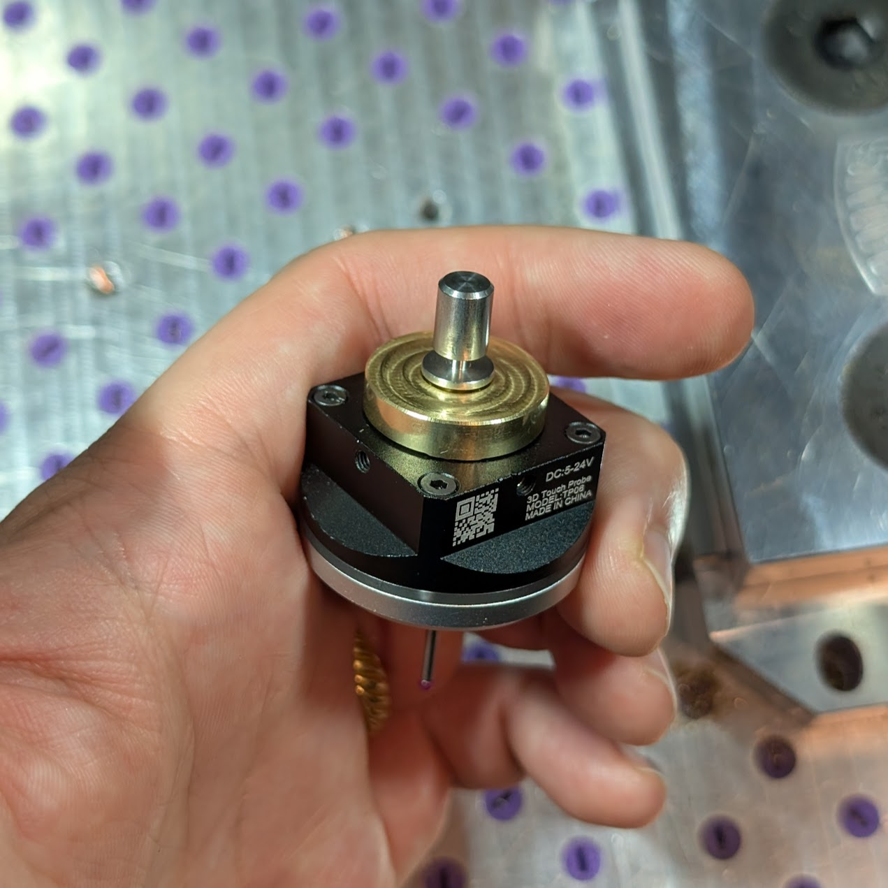

# What is it?

    

An adapter to allow reuse of the standard Carvera Z-probe tail shafts with the 3D touch probe. This allows for easy use of the 3D touch probe with the different collet sizes available.

Adapter is machinable on the Carvera/Carvera Air out of brass or other suitable material.

# Required Items
- [3D touch probe](https://www.aliexpress.us/item/3256803280100804.html) - this is available in two shank sizes - 6mm and 4mm -- but either will work with this mod.
  - Note that this probe requires use of the community firmware and controller to properly utilize.
  - Instructions for use on [Instructables](https://www.instructables.com/Carvera-Touch-Probe-Modifications/) -- thanks to The Props Monster
- Dial test indicator([Example](https://www.amazon.com/Neoteck-Indicator-Magnetic-Dovetail-Measurement/dp/B09W2R3SCD/)) - for adjusting concentricity of the probe tip with the spindle.
  - A reasonable degree of accuracy can achieved by eye, but this makes things much easier and more repeatable.

# Installation
1. Fully loosen the 4 grub screws around the 3D probe shank.
2. Remove the shank from the main probe body.
3. Remove the O-ring from the inner groove of the shank.
4. Place the O-ring on the inner groove of the adapter.
5. Place the adapter into the main probe body.
6. Tighten the 4 grub screws to lock the adapter in place.
7. Screw in a tail shaft of choice from the Carvera Z-probe
8. Calibrate concentricity via the grub screws using a dial test indicator

# Machining Notes
- Part is machinable as either two 3-axis ops, or a mix of 3-axis and 4-axis ops.
  - Fully 3-axis requires the use a bit capable of making undercuts, e.g. a T-slot mill. I used a 6mm shank, 2mm length T-slot mill for mine.
  -  Using the 4th axis does not require any undercut bits, but will still require two 3-axis ops to mill out the bores on both sides.
- It's highly recommended that you use a thread mill to cut the threads for the tail shaft adapter bore rather than using a tap, as a tap may not be able to cut the threads deep enough for the tail shafts to fully seat.
  - I had a loose fit using the default bore size and thread mill settings. A close fit was achieved by setting 0.15mm stock to leave on the bore, and setting a -0.5mm pitch diameter offset on the thread milling. Do some test threads in your material of choice to dial this in.
  - Refer to the technical drawing for full thread information.

# Misc Usage Notes
- If hot swapping tail shafts, concentricity is not guaranteed. This depends on the straightness and concentricity of the two ends of your tail shafts.
  - It's highly recommended to adjust concentricity for one tail shaft, and then use a dial test indicator to verify concentricity when switching to a different tail shaft, at least on the first switch between pairs.

<a href="https://github.com/leggomyfroggo/CarveraDump/tree/main/3DTouchProbeShankAdapter">3D Touch Probe Shank Adapter</a> © 2025 by <a href="https://github.com/leggomyfroggo">Chris Hackmann</a> is licensed under <a href="https://creativecommons.org/licenses/by-nc-sa/4.0/">CC BY-NC-SA 4.0</a>